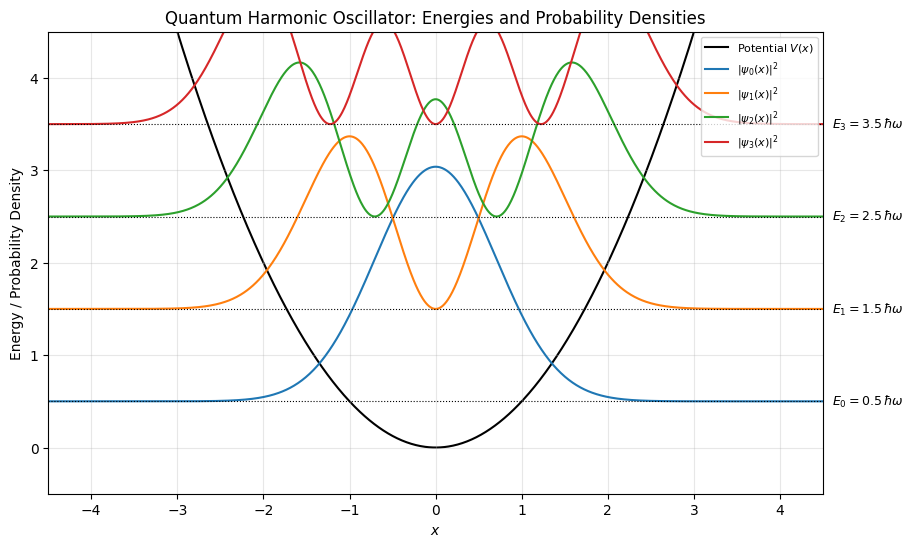

# ⚛️ Quantum Harmonic Oscillator Simulation

A **computational visualization of the quantum harmonic oscillator (QHO)** — one of the most fundamental systems in quantum mechanics.

This project illustrates how **quantized energy levels** emerge from the Schrödinger equation and how the **probability densities** evolve for each quantum state.

---

## ⚙️ Features

- 🧮 **Potential energy curve:** $V(x) = \frac{1}{2} m \omega^2 x^2$  
- 💡 **Energy eigenvalues:** $E_n = \left(n + \frac{1}{2}\right) \hbar \omega$  
- 🌐 **Hermite–Gaussian wavefunctions:** $\psi_n(x) = N_n H_n(x) e^{-x^2/2}$  
- 📊 **Probability densities:** $|\psi_n(x)|^2$ for visualizing quantum states  
- 🎨 **High-quality plots:** Combined visualization of potential, energy levels, and probability densities

---

## 🧠 Background

The quantum harmonic oscillator is a cornerstone of quantum mechanics, modeling vibrations, phonons, and many other systems. Its properties are determined by the **time-independent Schrödinger equation**:

$\hat{H} \psi_n(x) = E_n \psi_n(x), \quad \hat{H} = -\frac{\hbar^2}{2 m} \frac{d^2}{dx^2} + \frac{1}{2} m \omega^2 x^2$

The **normalized wavefunctions** are given by Hermite polynomials:

$\psi_n(x) = N_n H_n(x) e^{-x^2/2}, \quad N_n = \frac{1}{\sqrt{2^n n! \sqrt{\pi}}}$

with corresponding **energy levels**:

$E_n = \left(n + \frac{1}{2}\right) \hbar \omega, \quad n = 0,1,2,\dots$

These wavefunctions illustrate **quantization**: the system can only occupy discrete energy levels, with probability densities describing where the particle is likely to be found.

---

## 📊 Example Outputs

### 🔹 Potential and Probability Densities

The plot shows the potential curve $V(x)$, the energy levels $E_n$, and the corresponding probability densities $|\psi_n(x)|^2$ for several quantum states.

---

## 🧰 Technologies Used

| Category | Libraries |
|-----------|------------|
| **Core** | `Python`, `NumPy`, `Matplotlib`, `SciPy` |
| **Development** | `Jupyter Notebook` |

---

## 🚀 Installation

1. Clone the repository:  

git clone https://github.com/pagrid/Classical-Physics.git

📝 License

This project is released under the MIT License

