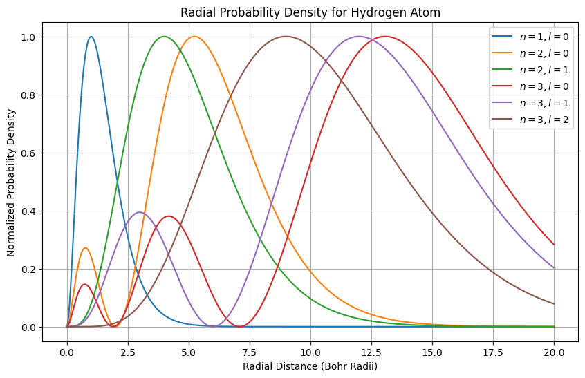
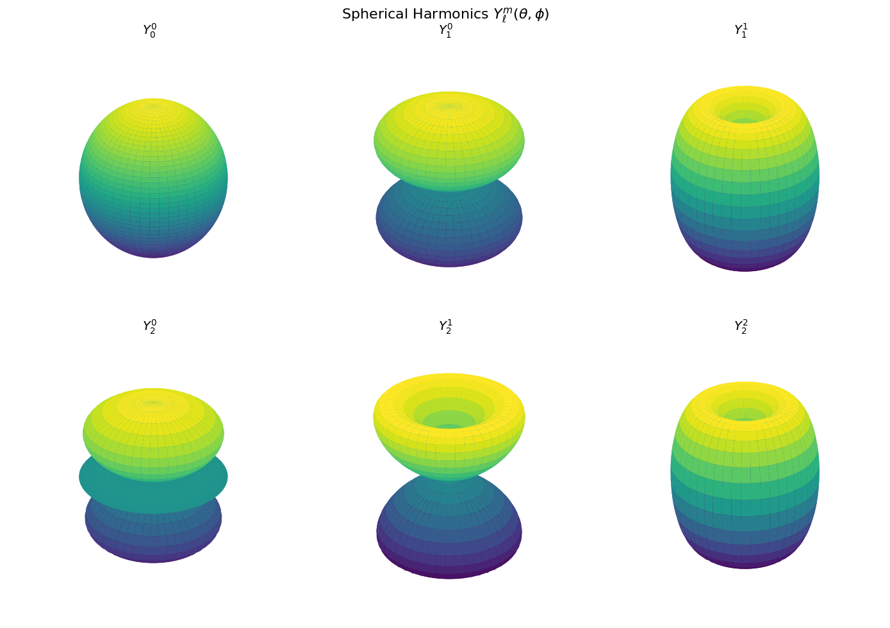
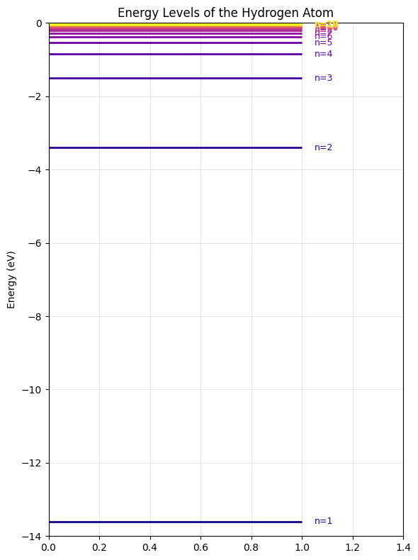
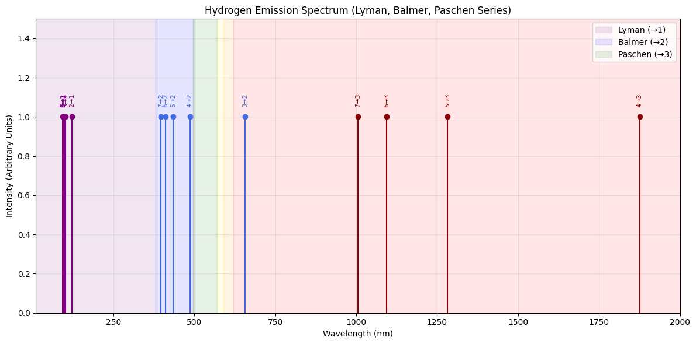
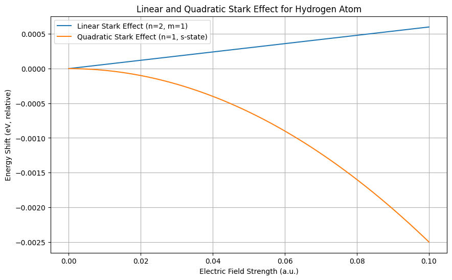

# ⚛ Hydrogen Atom Simulation

A **computational exploration of the hydrogen atom**, including quantum states, energy levels, emission spectra, and the Stark effect.

This project provides interactive and visual insights into the radial and angular wavefunctions, discrete energy levels, emission lines (Lyman, Balmer, Paschen series), and linear & quadratic Stark shifts.

---

## ⚙️ Features

- 🧮 **Radial probability densities:** Visualizes $R_{nl}(r)$ for different quantum states  
- 🌐 **Angular wavefunctions:** 3D plots of spherical harmonics $Y_\ell^m(\theta, \phi)$  
- 💡 **Energy levels:** Computes and visualizes discrete hydrogen atom energy levels $E_n = -13.6 / n^2$ eV  
- 📊 **Emission spectra:** Simulates Lyman, Balmer, and Paschen series  
- ⚡ **Stark effect:** Linear and quadratic energy shifts under an electric field  
- 🎨 **High-quality visualizations:** 2D and 3D plots using `Matplotlib` and `NumPy`

---

## 🧠 Background

The hydrogen atom is a fundamental system in quantum mechanics. Its properties are described by the Schrödinger equation in spherical coordinates: 

$\hat{H} \ \psi(r,\theta,\phi) = E \ \psi(r,\theta,\phi), \quad
\hat{H} = -\frac{\hbar^2}{2 m} \nabla^2 - \frac{e^2}{4 \pi \varepsilon_0 r}$

**Radial Schrödinger equation solution:**  

$R_{nl}(r) = \sqrt{\left(\frac{2}{n a_0}\right)^3 \frac{(n-l-1)!}{2 n (n+l)!}} \ e^{- \rho / 2} \rho^l L_{n-l-1}^{2l+1}(\rho), \quad \rho = \frac{2 r}{n a_0}$
 

**Angular solution (spherical harmonics):**  

$Y_\ell^m(\theta, \phi) = (-1)^m \sqrt{\frac{2\ell + 1}{4\pi} \frac{(\ell - m)!}{(\ell + m)!}} \ P_\ell^m(\cos\theta) \ e^{i m \phi}$

**Energy levels:**  

$E_n = - \frac{13.6 \text{ eV}}{n^2}, \quad n=1,2,3,\dots$

**Stark effect:** Linear and quadratic shifts under an external electric field.

---

## 📊 Example Outputs

### 🔹 Radial Probability Densities

### 🔹 Angular Wavefunctions (Spherical Harmonics)

### 🔹 Energy Levels

### 🔹 Emission Spectrum (Lyman, Balmer, Paschen)

### 🔹 Stark Effect

---

