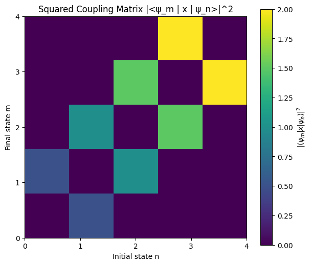
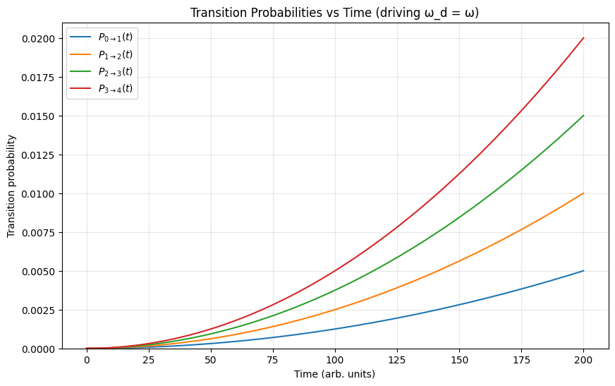
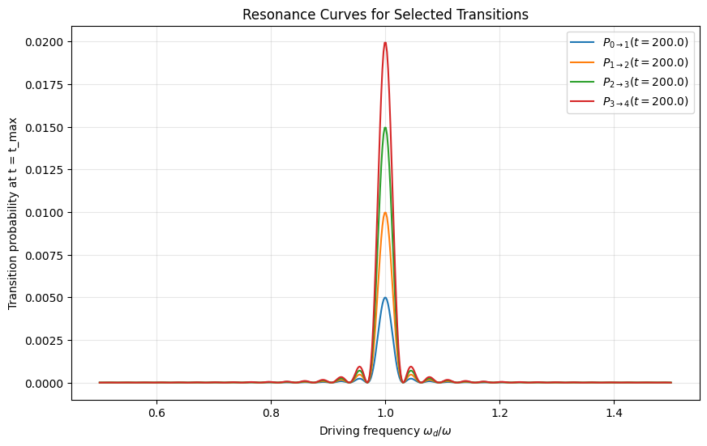

# ⚛️ Time-Dependent Perturbations in the Quantum Harmonic Oscillator

A **computational exploration of time-dependent perturbations** in the quantum harmonic oscillator (QHO).

This project computes **matrix elements**, visualizes **coupling strengths**, evaluates **transition probabilities** under a harmonic driving force, and scans **resonance curves** versus driving frequency.

---

## ⚙️ Features

- 🧮 **Matrix elements:** $\langle \psi_m | x | \psi_n \rangle$ for the QHO basis  
- 📊 **Squared coupling strengths:** $|\langle \psi_m | x | \psi_n \rangle|^2$ visualized as a matrix  
- ⏱️ **Time-dependent transition probabilities:** $P_{n \to m}(t)$ under a harmonic driving force  
- 🌐 **Resonance analysis:** Transition probabilities as a function of driving frequency $\omega_d$  
- 🎨 **High-quality plots:** Time evolution and resonance curves for selected transitions

---

## 🧠 Background

Time-dependent perturbation theory describes how quantum systems respond to external forces. For a harmonic oscillator subjected to a driving term $F_0 \cos(\omega_d t)$, the **transition probability** between states $|n\rangle$ and $|m\rangle$ can be estimated as:

$P_{n \to m}(t) \sim \frac{| \langle \psi_m | x | \psi_n \rangle F_0 |^2}{\Delta^2} \sin^2 \left( \frac{\Delta t}{2 \hbar} \right), \quad
\Delta = E_m - E_n - \hbar \omega_d$

On resonance ($\Delta \approx 0$), this simplifies to:

$P_{n \to m}(t) \sim \frac{| \langle \psi_m | x | \psi_n \rangle F_0 |^2}{\hbar^2} \frac{t^2}{4}$

Here, the **matrix elements** $\langle \psi_m | x | \psi_n \rangle$ are computed numerically using the **Hermite–Gaussian wavefunctions** of the QHO:

$\psi_n(x) = N_n H_n(\sqrt{\alpha} x) e^{-\alpha x^2 / 2}, \quad
N_n = \left(\frac{\alpha}{\pi}\right)^{1/4} \frac{1}{\sqrt{2^n n!}}$

---

## 📊 Example Outputs

### 🔹 Squared Coupling Matrix

Matrix visualization of $|\langle \psi_m | x | \psi_n \rangle|^2$ for the first few energy levels.

### 🔹 Time-Dependent Transition Probabilities

Evolution of $P_{n \to m}(t)$ for selected transitions under a driving force at $\omega_d = \omega$.

### 🔹 Resonance Curves

Transition probabilities at fixed time $t_{\rm max}$ as a function of driving frequency $\omega_d / \omega$.

---

## 📝 License
This project is released under the [MIT License](LICENSE).

