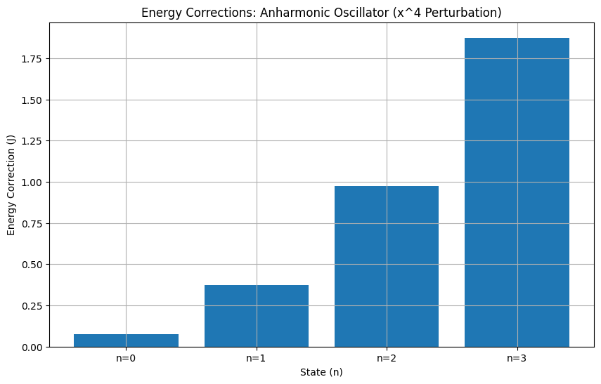
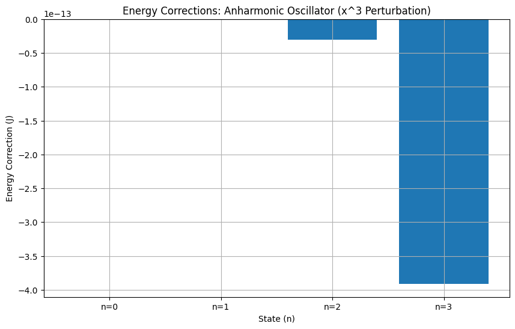
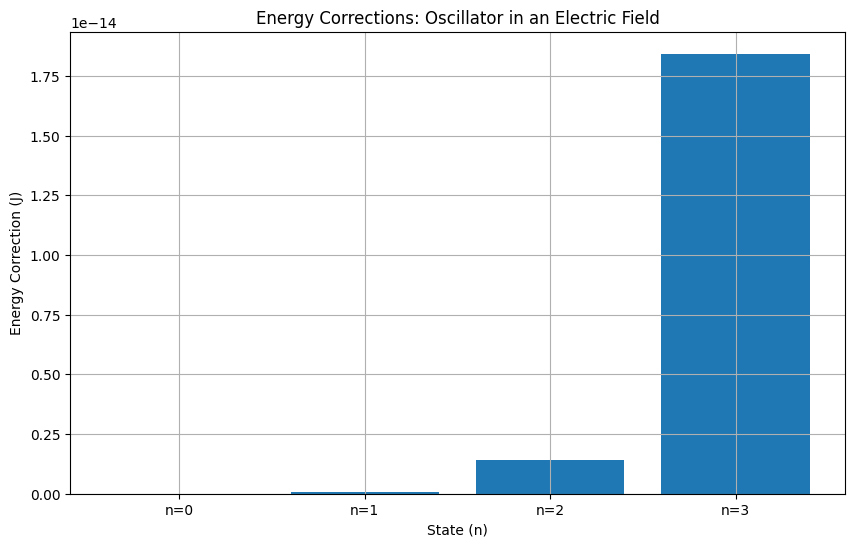
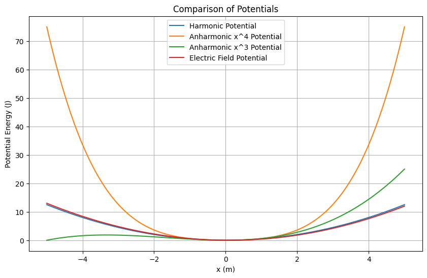

# ⚛️ Time-Independent Perturbations in the Quantum Harmonic Oscillator

A **computational study of time-independent perturbations** applied to the quantum harmonic oscillator (QHO).

This project analyzes the effects of **anharmonic perturbations ($x^3$, $x^4$)** and **external electric fields** on the energy levels of the QHO, computing **first-order energy corrections** numerically.

---

## ⚙️ Features

- 🧮 **Harmonic oscillator potential:** $V_0(x) = \frac{1}{2} m \omega^2 x^2$  
- 💡 **Time-independent perturbations:**  
  - Anharmonic: $V_{\rm pert} = \lambda_3 x^3$, $V_{\rm pert} = \lambda_4 x^4$  
  - Electric field: $V_{\rm pert} = - m E_{\rm field} x$  
- 📊 **Energy corrections:** First-order perturbation theory:  
  $E_n^{(1)} = \langle \psi_n | V_{\rm pert} | \psi_n \rangle$  
- 🎨 **Visualization:** Comparison of potentials and energy corrections, plus probability densities $|\psi_n(x)|^2$.

---

## 🧠 Background

Time-independent perturbation theory provides a way to estimate **how energy levels shift** when a quantum system experiences a small static perturbation. For a harmonic oscillator, the **first-order energy correction** for state $|n\rangle$ is:

$E_n^{(1)} = \langle \psi_n | V_{\rm pert} | \psi_n \rangle$

where $\psi_n(x)$ are the **Hermite–Gaussian wavefunctions** of the unperturbed oscillator:

$\psi_n(x) = N_n H_n(\sqrt{\alpha} x) e^{-\alpha x^2 / 2}, \quad
N_n = \frac{(\alpha/\pi)^{1/4}}{\sqrt{2^n n!}}, \quad \alpha = \frac{m \omega}{\hbar}$

The project demonstrates how **different perturbations modify the energy spectrum**, depending on their symmetry and order.

---

## 📊 Example Outputs

### 🔹 Harmonic Oscillator Potential and Probability Densities

The plot shows the harmonic potential $V_0(x)$ and the probability densities $|\psi_n(x)|^2$ for several states.

### 🔹 Energy Corrections: $x^4$ Perturbation

First-order energy shifts $E_n^{(1)}$ due to the anharmonic $x^4$ perturbation.

### 🔹 Energy Corrections: $x^3$ Perturbation

First-order energy shifts $E_n^{(1)}$ due to the anharmonic $x^3$ perturbation. Notice the symmetry-dependent effects.

### 🔹 Energy Corrections: Electric Field

Energy shifts $E_n^{(1)}$ when the oscillator is subjected to a constant electric field.

### 🔹 Comparison of Perturbed Potentials

Visualization of all perturbed potentials alongside the original harmonic potential.

---

## 📝 License
This project is released under the [MIT License](LICENSE).

